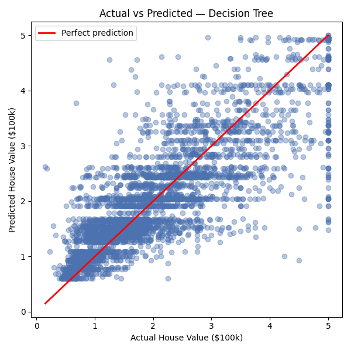
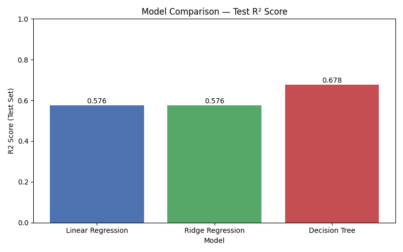
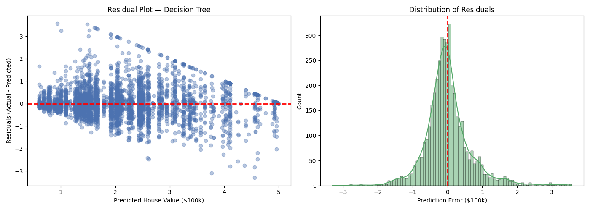
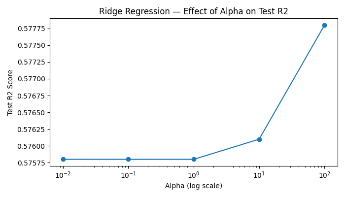

# 🏡 California House Price Prediction Pipeline & Analytics Dashboard

[](https://www.python.org/)
[](https://streamlit.io/)
[](https://scikit-learn.org/)
[](LICENSE)

An end-to-end **Machine Learning Regression Pipeline** and production-ready **Analytics Dashboard** built with Streamlit. This repository handles the complete machine learning lifecycle—from automated data preprocessing and hyperparameter optimization to statistical model benchmarking, visualization, and cloud deployment.

---

## 📌 Executive Summary

This project implements a structured machine learning pipeline to resolve the regression task of predicting district-level **Median House Values** across California. Utilizing the authoritative California Housing Dataset, multiple algorithms were trained and benchmarked to select a high-generalizing production-grade model.

### Core Architecture Capabilities
* **Robust Pipeline Engineering:** Automated data cleaning, scaling, and feature validation.
* **Algorithmic Benchmarking:** Comparative assessment of baseline linear methods against non-linear tree-based structures.
* **Dynamic Diagnostics Suite:** Interactive performance analytics, residual tracking, and regularized parameter optimization curves.
* **Production-Ready Deployment:** Decoupled UI architecture presenting prediction engines and analytics via a multi-page interface.

---

## 🖥️ Application Architecture & Core Modules

The modular Streamlit application isolates production inference from model analysis across three distinct views:

### 1. Real-Time House Price Prediction (`Inference Engine`)
Accepts multi-dimensional geospatial, demographic, and socioeconomic features to serve real-time predictions:
* **Socioeconomic Context:** Median Income (`MedInc`)
* **Structural Metrics:** House Age, Average Rooms, Average Bedrooms
* **Demographic Densities:** Population, Average Occupancy
* **Geospatial Vectors:** Latitude, Longitude

### 2. Model Analytics Dashboard (`Evaluation Matrix`)
Exposes live visualization layers tracking performance boundaries, loss functions, and error distributions:
* Performance comparison metrics across all trained models.
* Dynamic regression plots evaluating model residuals, alpha tuning paths, and variance parameters.

### 3. Comprehensive Project Overview (`System Metadata`)
Details the overarching engineering workflow, underlying tech stack, and developer profile.

---

## 🤖 Model Engineering & Statistical Benchmarking

Three regression architectures were evaluated under rigorous train-test splitting parameters to establish baseline and production metrics:

| Model Architecture | Train $R^2$ | Test $R^2$ | Train $RMSE$ | Test $RMSE$ | Engineering Status |
| :--- | :---: | :---: | :---: | :---: | :--- |
| Linear Regression | 0.5812 | 0.5758 | 0.7411 | 0.7456 | Baseline Reference |
| Ridge Regression (L2 Regularized) | 0.5812 | 0.5758 | 0.7411 | 0.7456 | Hyperparameter Tuned Baseline |
| **Decision Tree Regressor** | **0.7230** | **0.6779** | **0.6012** | **0.6497** | 🏆 **Selected for Production** |

*Note: The Decision Tree Regressor exhibited superior variance explanation capabilities, achieving a Test $R^2$ score of **0.6779** and the lowest error margin ($RMSE$: **0.6497**), dictating its selection for operational deployment.*

---

##  Model Diagnostic Visualizations

### 1️⃣ Actual vs. Predicted Target Values
Evaluates the continuous target correlation. Tight clustering along the diagonal reference line demonstrates strong model convergence and reliable generalization across feature ranges.




---

### 2️⃣ Model Performance Comparison
A comparative breakdown highlighting $R^2$ maximization and corresponding $RMSE$ minimization across the candidate architectures, supporting programmatic model selection.


---

### 3️⃣ Residual Analysis
Monitors heteroscedasticity and variance distribution. A balanced, non-systemic scatter around the zero-error axis indicates highly unbiased prediction errors.


---

### 4️⃣ Ridge Regression Alpha Optimization
Maps the optimization path for the L2 regularization parameter ($\alpha$). This visual guide demonstrates the impact of hyperparameter tuning on controlling variance and stabilizing validation scores.



---

## 🛠️ Technology Stack

| Domain | Technologies |
| :--- | :--- |
| **Programming Language** | Python (>= 3.9) |
| **Data Engineering & Computation** | Pandas, NumPy |
| **Machine Learning Core** | Scikit-Learn |
| **Visualization & Reporting** | Plotly, Matplotlib |
| **Artifact Serialization** | Joblib |
| **Web Presentation Framework** | Streamlit |
| **Version Control** | Git & GitHub |

---

##  Repository Topology

```text
California-House-Price-Prediction/
│
├── .github/                     # Automated workflows / CI configurations
├── images/                      # Static assets, UI components, and diagnostic plots
│   ├── actual_vs_predicted.png
│   ├── model_comparison.png
│   ├── residual_plot.png
│   ├── ridge_alpha_tuning.png
├── app.py                       # Application execution entry point
├── requirements.txt             # Locked production dependencies
├── README.md                    # Core technical documentation
├── house_price_model.pkl        # Serialized production Decision Tree model
├── linear_regression.pkl        # Serialized standard linear baseline
├── ridge_regression.pkl         # Serialized regularized linear baseline
└── model_metrics.csv            # Structured validation performance ledger


---

# 💻 Local Installation & Execution

Follow these steps to run the project locally.

## 1. Clone the Repository

```bash
git clone https://github.com/your-username/California-House-Price-Prediction.git
cd California-House-Price-Prediction
```

## 2. Create a Virtual Environment (Optional but Recommended)

**Windows**

```bash
python -m venv venv
venv\Scripts\activate
```

**Linux / macOS**

```bash
python3 -m venv venv
source venv/bin/activate
```

## 3. Install Dependencies

```bash
pip install --upgrade pip
pip install -r requirements.txt
```

## 4. Run the Streamlit Application

```bash
streamlit run app.py
```

The application will open in your browser at:

```
http://localhost:8501
```

---

# 🚀 Future Improvements

- Implement Random Forest, XGBoost, and LightGBM models
- Perform hyperparameter tuning using GridSearchCV or Optuna
- Add SHAP and LIME for model explainability
- Deploy the application using Docker
- Build a REST API using FastAPI
- Automate testing and deployment with GitHub Actions
- Add user authentication and prediction history
- Improve dashboard with additional interactive visualizations

---

#  Acknowledgments

This project was developed as part of the **Maincraft Technology Pvt. Ltd. Machine Learning Internship**.

Special thanks to:

- Scikit-Learn
- Pandas
- NumPy
- Plotly
- Streamlit
- California Housing Dataset contributors

---

** If you found this project useful, consider giving it a star on GitHub!**

## About Developer
**Asma | AI/ML Intern **
